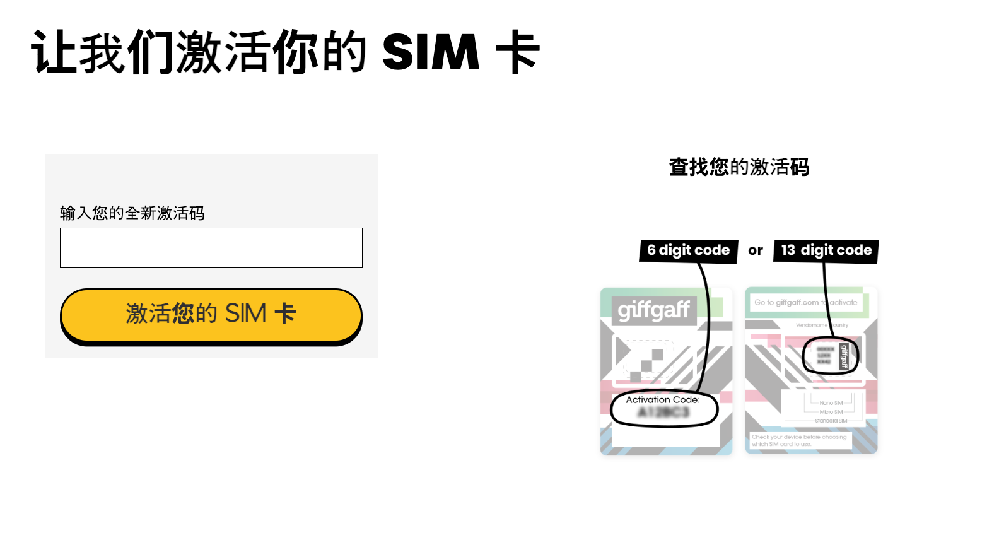
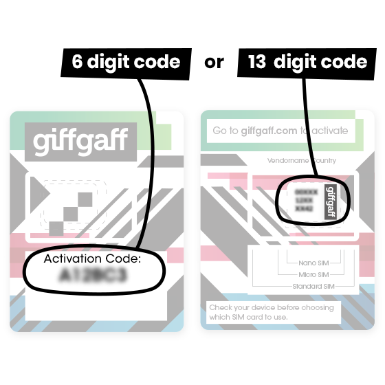
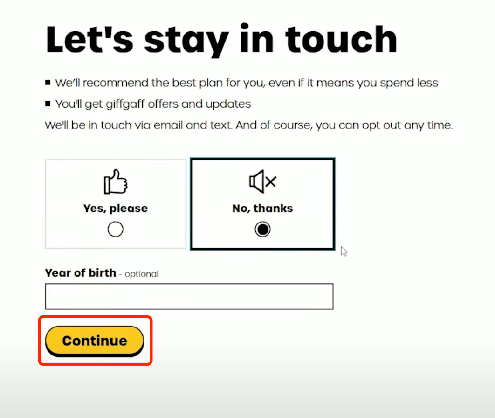

# 激活 SIM

## 适用场景

你已经拿到 giffgaff 实体 SIM，想把它绑定到自己的 giffgaff 账号，并让号码可以收短信、打电话或使用数据。

## 准备材料

- giffgaff SIM 卡或 SIM 卡包装。
- SIM 包装上的 activation code。常见位置见下图：有的卡套正面是 6 位激活码，有的卡套背面可用 13 位 SIM serial number。
- 一个可收邮件的邮箱。
- 可用的支付方式。境外用户常见选择是银行卡或 PayPal，是否可用以结算页面为准。
- 手机最好先连 Wi-Fi，等激活完成后再插卡或重启。

## 激活步骤

页面文案可能会调整，但完整激活通常会经过下面这些步骤。

1. 打开官方激活入口：<https://www.giffgaff.com/activate>。
2. 在输入框里填入 activation code。优先使用卡套上明确写着 `Activation Code` 的 6 位代码；如果页面提示可用 13 位代码，再输入 SIM 卡背面或卡套上的 13 位 SIM serial number。
3. 点击激活按钮。如果提示代码无效，先检查是否把字母 `O` 和数字 `0`、字母 `I` 和数字 `1` 混淆；仍失败时换浏览器或无痕窗口再试。
4. 创建 giffgaff 账号，或登录已有账号。新账号需要填写邮箱、密码，并按页面要求完成基础资料。
5. 打开邮箱，完成 giffgaff 发送的验证或确认步骤。如果没有收到邮件，先查垃圾邮件，再确认邮箱拼写。
6. 填写个人资料和联系信息。页面可能会要求姓名、出生年份、地址或营销偏好；营销邮件和短信可以按需拒绝。
7. 选择首次使用方式。常见选项是购买 monthly plan、购买 goodybag，或先充值余额按量使用。人在英国境外、只想保号或收验证码时，优先看清是否会自动续费、是否包含漫游使用限制。
8. 选择支付方式并付款。银行卡、PayPal、voucher 等选项是否可用，以结算页实际显示为准。提交前确认金额、续费开关和条款勾选状态。
9. 等页面显示激活已提交或完成。不要反复刷新支付页；如果支付已扣款但页面卡住，先登录 giffgaff 后台查看订单和 SIM 状态。
10. 把 SIM 插入手机并重启。双卡手机要确认 giffgaff SIM 已启用，并把语音、短信或数据线路切到正确号码。
11. 等待手机注册网络。通常几分钟内会有信号，但个别情况可能需要更久；官方提示最长可能需要 24 小时。期间保持手机开机，必要时手动搜索网络。
12. 登录 giffgaff 后台确认号码、余额和 plan 状态。能看到手机号、余额或 plan 后，再测试收短信、拨打电话和上网。

## 页面选择建议

- 只想先让卡生效：选择最小成本的充值或按页面允许的最低方案，不要开启不需要的自动续费。
- 需要马上在英国使用流量：选择合适的数据 plan，并确认手机 APN 自动下发成功。
- 在中国大陆或其他英国境外地区使用：先关闭数据漫游，只保留蜂窝网络注册和短信；需要上网前先查漫游价格。
- 已有 giffgaff 账号：登录后确认不要把新 SIM 误绑定到不想使用的旧号码或旧套餐。

## 常见卡点

- 找不到激活码：检查 SIM 卡套正反面，查找 `Activation Code`、条形码附近的 13 位数字，或回到官方激活页看示意图。
- 激活码无效：确认 SIM 没被别人激活过；换浏览器、清缓存、关闭翻译插件后再试。
- 收不到确认邮件：检查垃圾邮件、广告邮件夹；邮箱填错时通常需要重新开始或联系官方支持。
- 付款失败：换支付方式，或确认银行卡允许境外/线上支付。不要连续重复提交多次。
- 激活后没信号：重启手机、手动选网、换卡槽；仍无信号时等待一段时间再查后台状态。

## APN 检查

如果 SIM 已有信号但无法上网，手动检查 APN：

- APN：`giffgaff.com`
- 用户名：`gg`
- 密码：`p`

iPhone 通常会自动下发配置。Android 机型如果没有自动配置，可以在“移动网络”或“接入点名称”里新增 APN。

## 激活后建议

- 先确认能收到短信。
- 登录 giffgaff 后台检查号码、余额和 plan 状态。
- 如果人在英国境外，先不要大量开数据漫游，漫游资费请先到官方页面查询。
