# 激活 SIM

## 开始前先准备好

你已经拿到 giffgaff 实体 SIM，想把它绑定到自己的 giffgaff 账号，并让号码可以收短信、打电话或使用数据。激活时建议先不要插卡，手机和电脑保持 Wi-Fi 在线。

- SIM 卡或 SIM 卡包装上的 activation code。
- 一个可收验证码邮件的邮箱。
- 可用的银行卡、PayPal、voucher 或页面显示的其他支付方式。
- 如果页面要求地址，请使用真实可用的联系地址、住宿地址或收件地址。

> 页面可能会更新。下面截图展示的是典型激活路径。giffgaff 会调整页面文案和套餐入口，操作时以你实际看到的按钮和金额为准。

## 激活步骤

### 01. 输入激活码

打开 <https://www.giffgaff.com/activate>。在输入框里填入卡套上的 13 位SIM serial number，然后点击 **Activate your SIM**。

如果卡套上有6位 Activate Code也可使用。

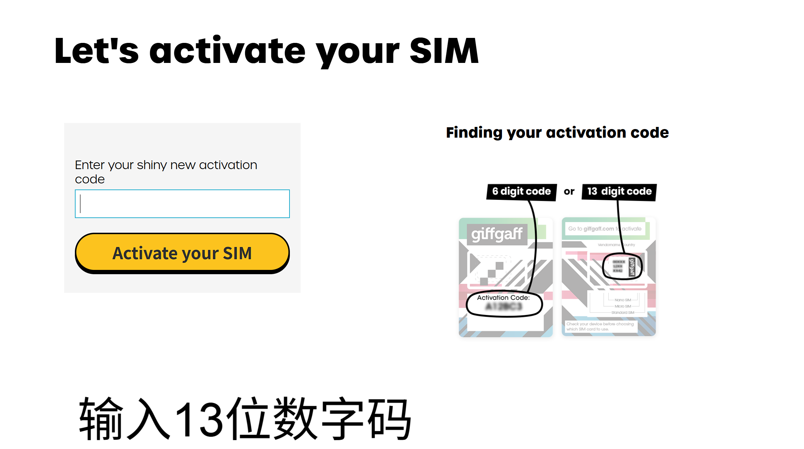

### 02. 填写邮箱

输入你要绑定到 giffgaff 账号的邮箱，点击 **Next**。这个邮箱后续会用于登录、找回密码和接收激活通知。

建议使用长期可访问的邮箱，不要使用临时邮箱。

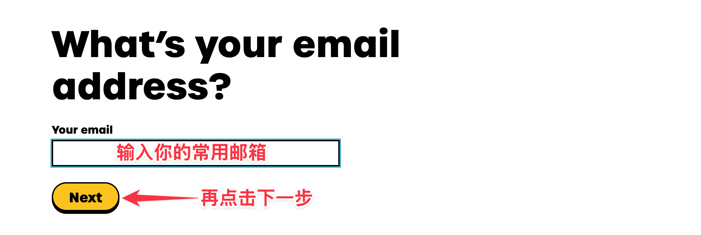

### 03. 确认邮箱验证码

打开邮箱，找到 giffgaff 发来的验证码邮件，把验证码填回页面并点击 **Confirm**。

如果没收到邮件，先检查垃圾邮件、广告邮件夹，再确认邮箱拼写是否正确。

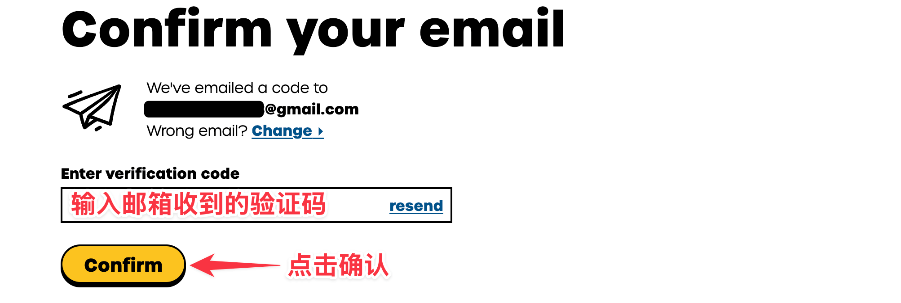

### 04. 创建账号密码

设置 giffgaff 账号密码，按页面要求达到长度和复杂度后点击 **Register**。

这个账号会管理余额、套餐、SIM 状态和后续补卡、换卡等操作，请保存好登录信息。

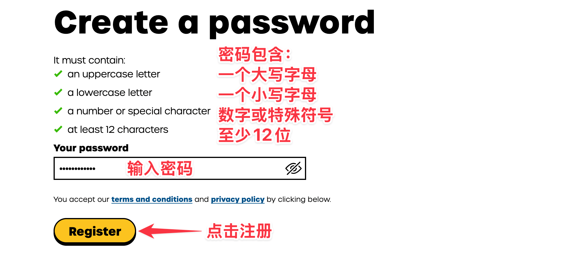

### 05. 跳过不需要的额外选择

如果页面询问是否需要额外推荐或增值选项，按自己的使用场景选择。只想先激活 SIM 的用户，通常可以选择 **No, thanks** 后继续。

提交前看清页面是否会开启自动续费或绑定额外服务。

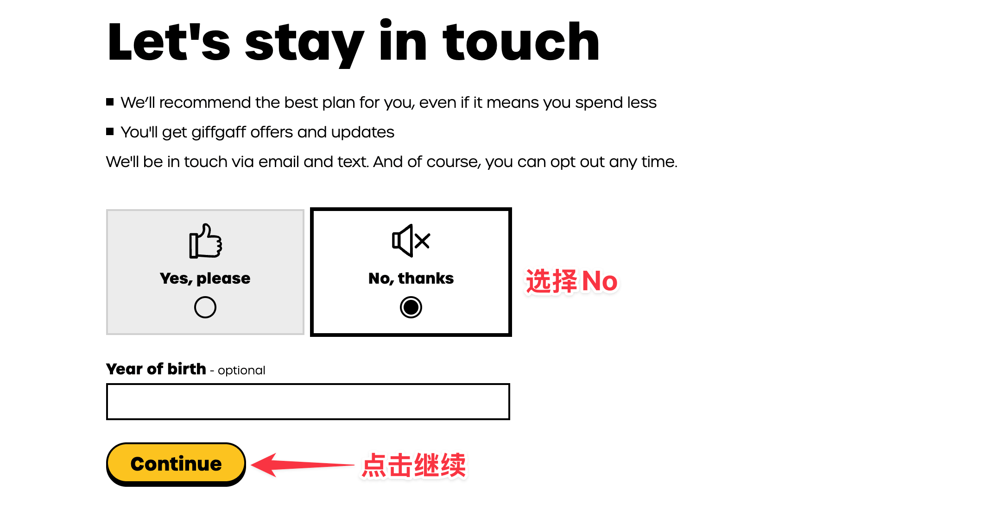

### 06. 选择 Pay as you go

如果你主要用于收短信、保号或低频使用，可以下拉找到 **Pay as you go**。如果需要长期流量，也可以按页面选择合适 plan。

人在英国境外时，先看清漫游限制和续费开关，再继续。

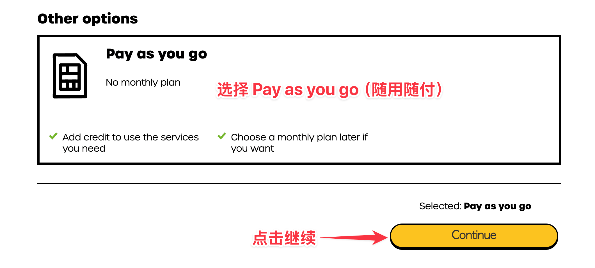

### 07. 选择充值金额或 voucher

页面会让你选择首次充值金额或兑换充值券。使用银行卡或 PayPal 时按页面显示的金额继续；已有 voucher 时选择兑换入口并输入券码。

金额和可用支付方式会变化，以结算页面实际显示为准。

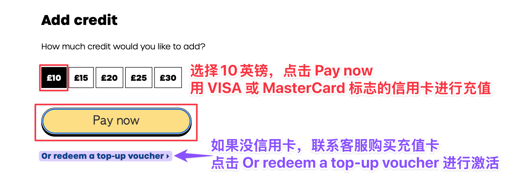

### 08. 填写个人资料和地址

按页面要求填写姓名、地址和联系信息。地址用于账单、账号资料或合规校验，请使用真实可用的信息。

营销邮件、短信和偏好设置可以按自己的需要选择。

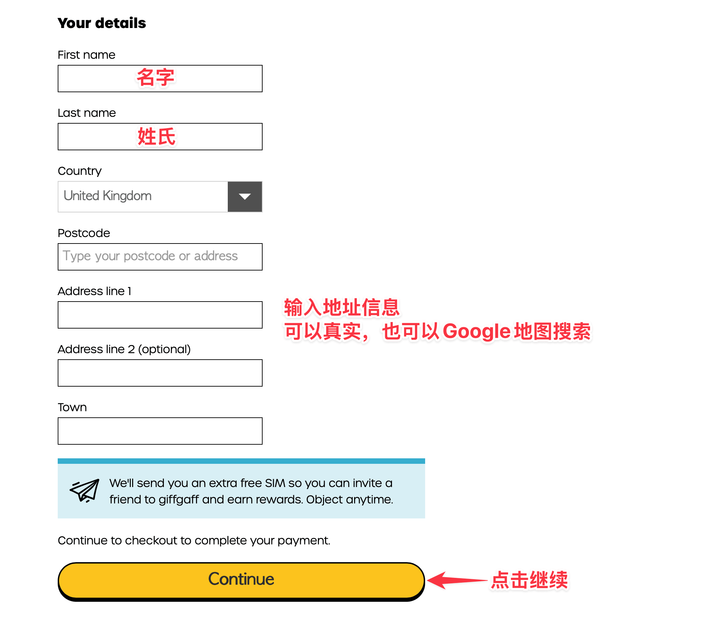

### 09. 确认支付

输入支付信息，检查金额、条款勾选和续费开关，然后点击 **Place order**。不要在支付处理中反复刷新页面。

如果扣款后页面卡住，先登录 giffgaff 后台查看订单和 SIM 状态，再决定是否重试。

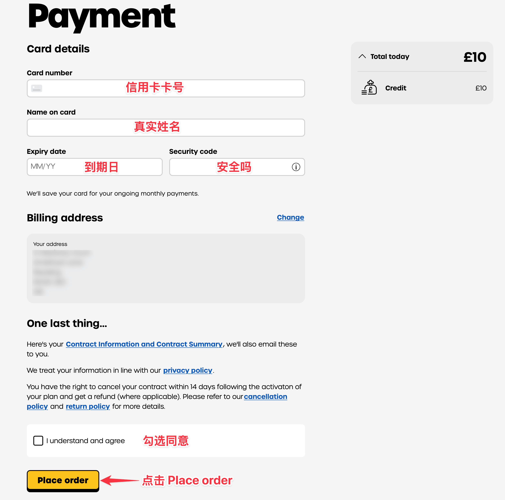

### 10. 记录分配到的号码

激活成功后页面会显示你的 giffgaff 手机号，英国号码通常以 +44 开头。先把号码记录下来，后续登录、验证和收短信会用到。

如果页面还在处理中，等待一段时间后再刷新后台状态。

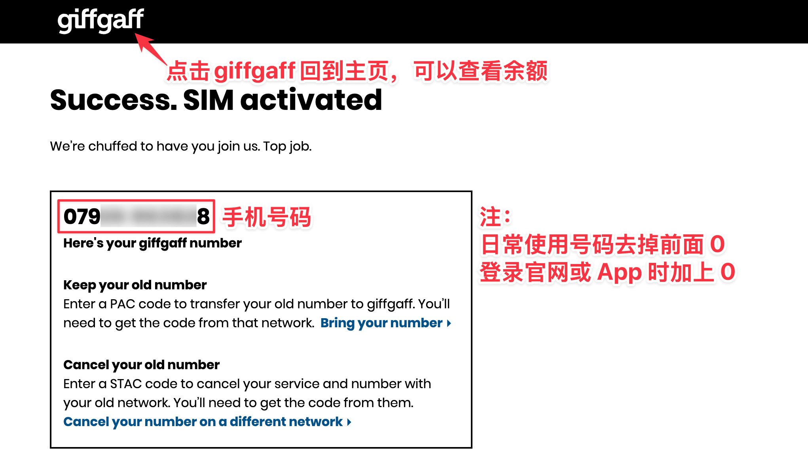

### 11. 回到主页确认余额

回到 giffgaff 主页或后台，确认能看到余额、plan 或 SIM 状态。然后插卡重启手机，等待注册网络。

通常几分钟到几小时内会生效，个别情况最长可能需要 24 小时。能看到号码和余额后，再测试收短信、拨打电话和上网。

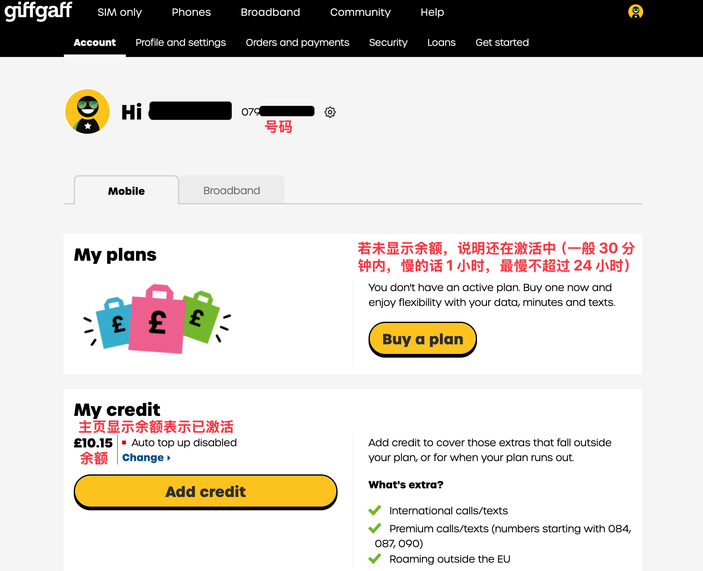

## 常见卡点

- 找不到激活码：检查 SIM 卡套正反面，查找 `Activation Code`、条形码附近的 13 位数字，或回到官方激活页看示意图。
- 激活码无效：确认 SIM 没被别人激活过；换浏览器、清缓存、关闭翻译插件后再试。
- 收不到确认邮件：检查垃圾邮件、广告邮件夹；邮箱填错时通常需要重新开始或联系官方支持。
- 付款失败：换支付方式，或确认银行卡允许境外/线上支付。不要连续重复提交多次。
- 激活后没信号：重启手机、手动选网、换卡槽；仍无信号时等待一段时间再查后台状态。

## APN 检查

如果 SIM 已有信号但无法上网，手动检查 APN：

- APN：`giffgaff.com`
- 用户名：`gg`
- 密码：`p`

iPhone 通常会自动下发配置。Android 机型如果没有自动配置，可以在“移动网络”或“接入点名称”里新增 APN。
