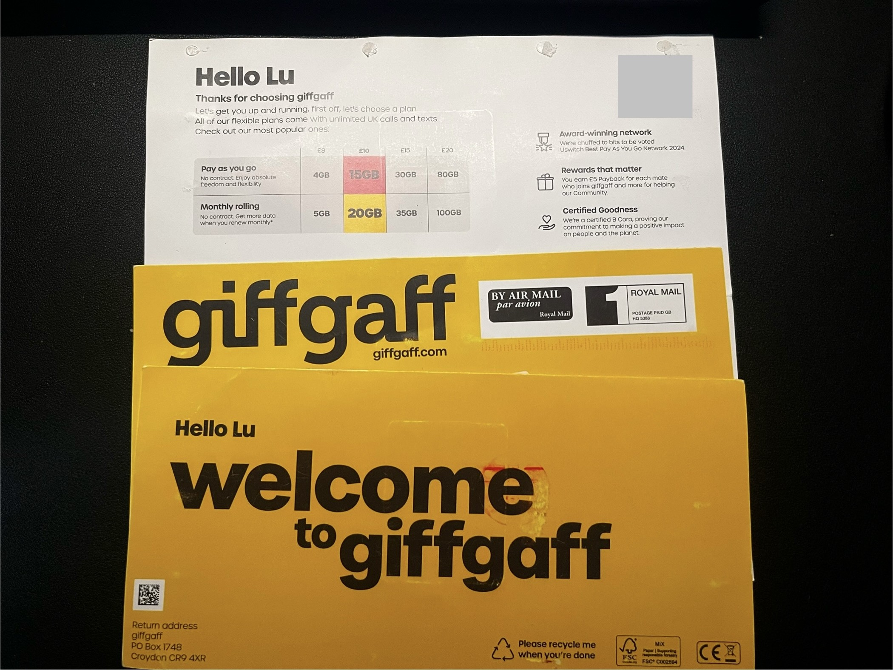

# 保号和日常使用

## 核心原则

giffgaff 号码不能长期完全闲置。保号前请先查看官方条款和帮助中心，因为“有效使用”的判定和停机流程可能调整。

建议保守做法：

- 至少每几个月登录一次账号，确认余额和号码状态。
- 定期做一次可计费行为，例如发送短信、拨打电话、使用少量数据或充值。
- 不要只依赖接收验证码。单纯收短信通常不等同于主动使用。

## 在中国大陆保号

在中国大陆使用时，常见目标是接收英国号码短信验证码。建议：

1. 关闭数据漫游，避免误产生高额流量费用。
2. 只在需要时开机收短信。
3. 保号日历设置提醒，提前做一次有效使用。
4. 每次操作后登录 giffgaff 后台确认余额变化和号码状态。

## 常用查询

这些代码可能因地区、网络和 giffgaff 当前策略而有差异，失败时以 App 或网页后台为准。

- 查余额：`*100#`
- 查 goodybag 或 plan 状态：`*100*7#`

## 风险提示

- 不要把 giffgaff 当作长期零成本保号服务。
- 不要把号码只绑定在一个关键账号上，重要服务请准备备用验证方式。
- 任何第三方代充、代激活或 eSIM 转写服务，都有账号、资金和号码控制权风险。

