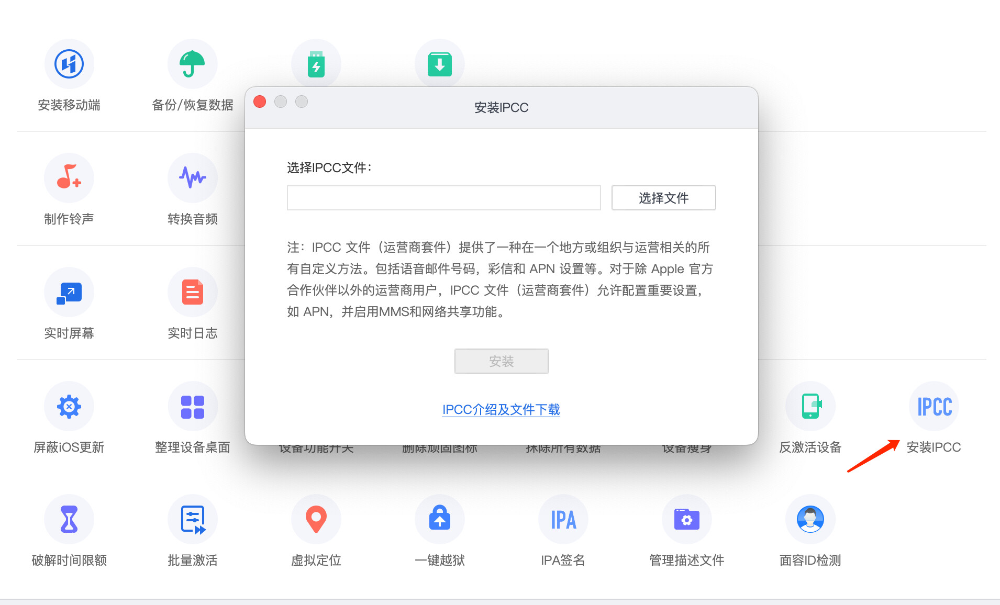
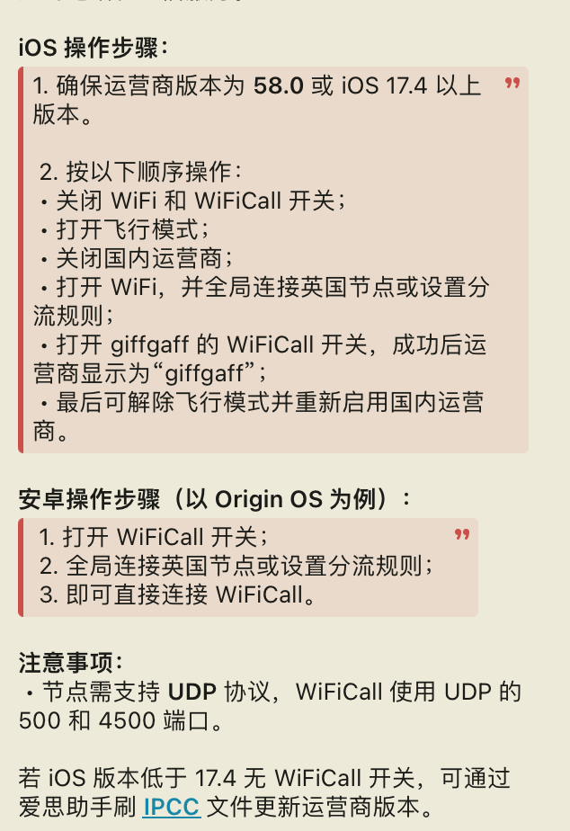

# 漫游、验证码和 Wi-Fi Calling

## 漫游前先查价格

giffgaff 的英国境外费用会按目的地和服务类型变化。出发或开卡前，请打开官方漫游页面查询目的地：

<https://www.giffgaff.com/roaming-charges>

建议把手机设置成：

- 数据漫游默认关闭。
- 只在确认价格后再打开数据。
- 需要收验证码时，先让手机注册当地网络，再等待短信。

## 收验证码

如果收不到短信：

1. 确认 SIM 已经激活。
2. 确认手机能注册到当地运营商网络。
3. 关闭飞行模式后等待几分钟。
4. 切换自动选网或手动选择另一个可用网络。
5. 确认发送方支持英国手机号，并且没有把短信发到旧号码。

## Wi-Fi Calling

如果账号、设备和系统版本支持，Wi-Fi Calling 可以在移动信号弱时通过 Wi-Fi 处理通话或短信相关能力。实际可用性以 giffgaff 帮助中心和手机设置为准。

iPhone 检查路径通常是：

1. 打开“设置”。
2. 进入“蜂窝网络”。
3. 选择 giffgaff 号码。
4. 查看是否有“Wi-Fi Calling”开关。

## eSIM 说明

参考帖里提到了把实体 SIM 转为 eSIM 的第三方方法。这个方向风险较高，因为它可能要求你把账号登录、验证码、SIM 信息或配置文件交给非官方工具处理。

本教程不建议把 giffgaff 主号码交给不明脚本或代操作服务。需要 eSIM 时，优先查看 giffgaff 官方是否已经在你的账号、设备和地区提供正式入口。

